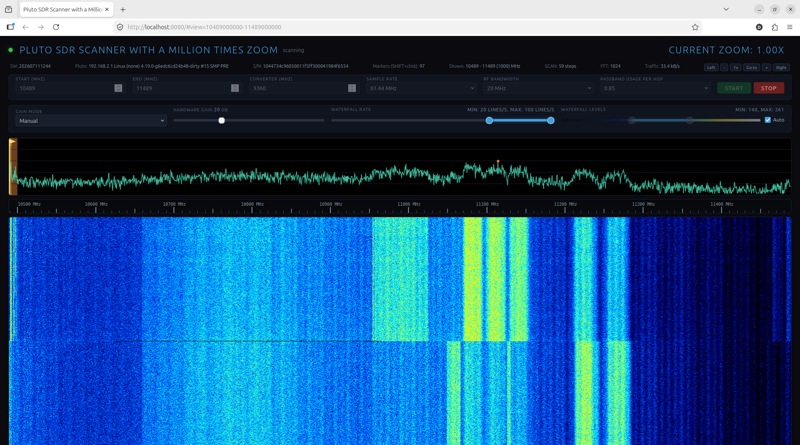
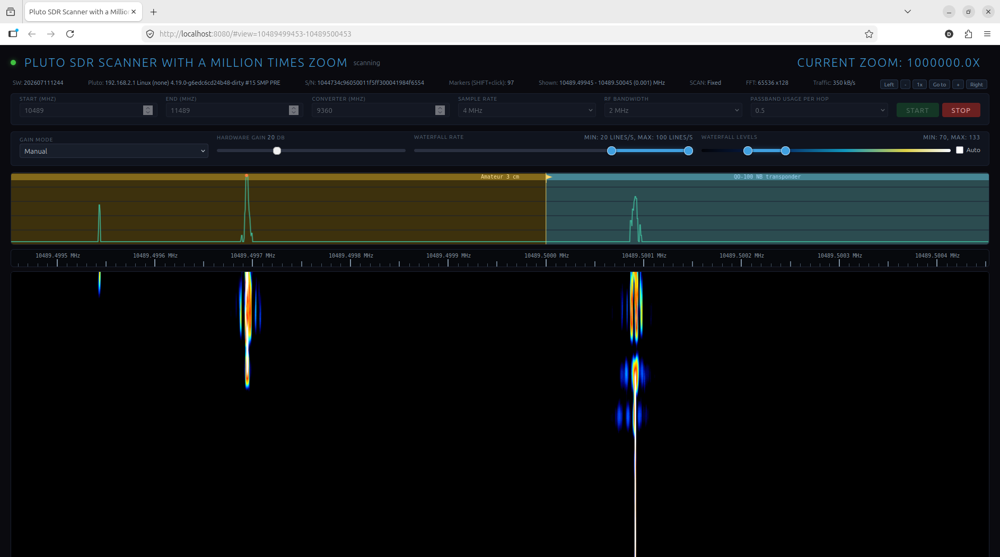
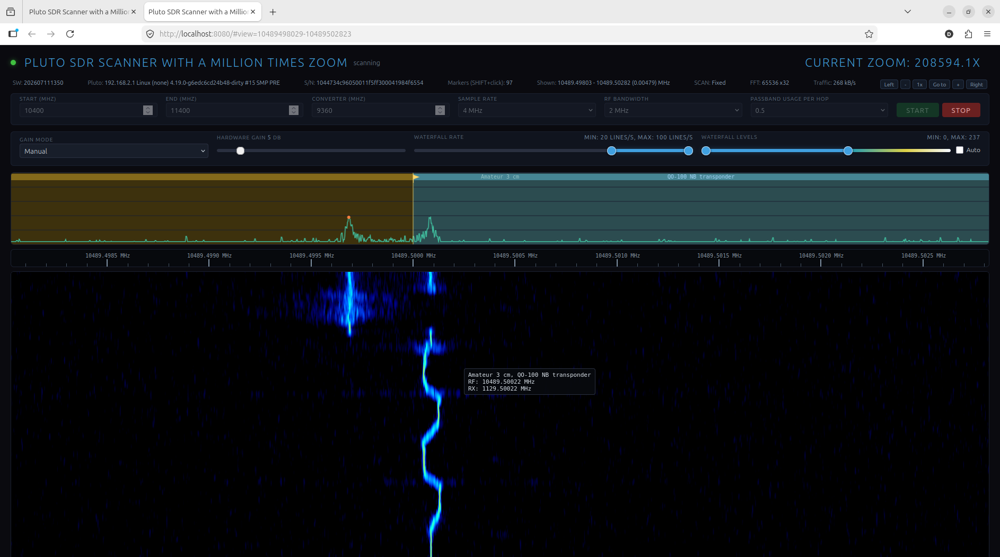
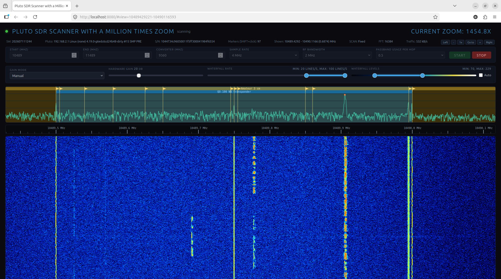
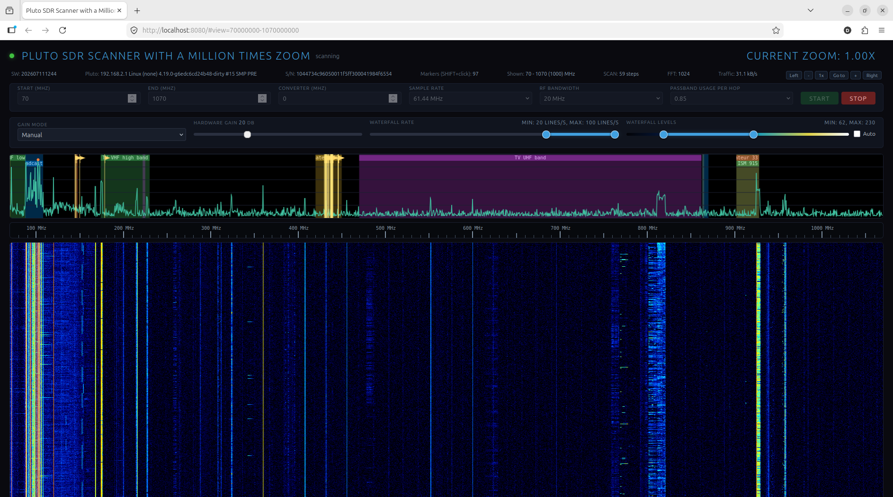
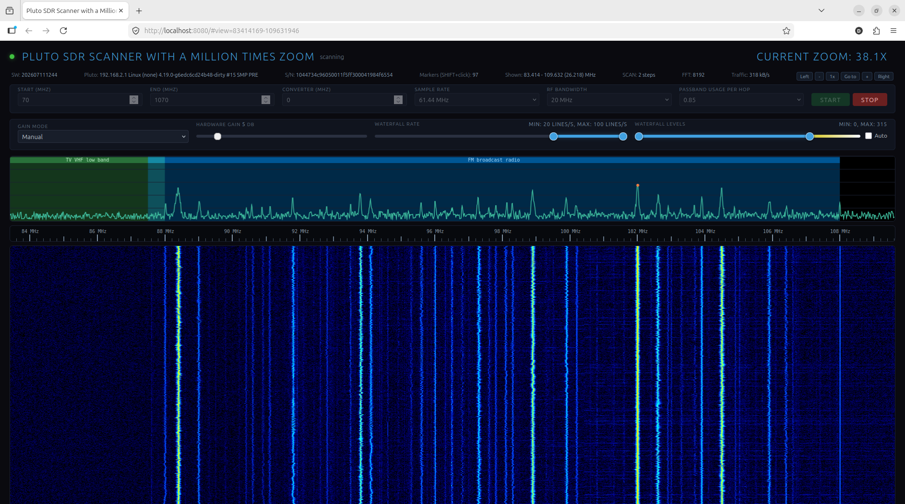

# Pluto SDR Scanner with a Million Times Zoom

Browser-based spectrum and waterfall scanner for ADALM-Pluto using `libiio`.

The app keeps the original scanner UI model: a small C HTTP server on
`localhost:8080` by default, a single-page `index.html` frontend, and live
spectrum/waterfall rows streamed over Server-Sent Events. Hardware scan
behavior is implemented as a host-side Pluto hop loop:

```text
set RX LO -> discard stale buffers -> refill useful buffer -> FFT -> publish row
```

## Releases

Release builds are published on GitHub:

https://github.com/ur8us/pluto-scanner/releases

Nightly builds are published as a prerelease named `nightly` and are refreshed
by the scheduled GitHub Actions workflow. Use them for testing recent changes;
use tagged releases when you need stable, reproducible files.

Expected release assets:

- `linux-x86_64` tar.gz and AppImage.
- `linux-aarch64` tar.gz and AppImage.
- `windows-x86_64` zip.
- `macos-universal` dmg.
- `SHA256SUMS.txt`.

The release builds use the network/XML libiio backends for the default
`ip:192.168.2.1` workflow. Runtime packages include `index.html`, `bands.ini`,
`markers.ini`, license, and project documentation beside the executable.

To download and unpack the Linux x86_64 tarball:

```sh
mkdir -p ~/Downloads/pluto-scanner
cd ~/Downloads/pluto-scanner

curl -LO https://github.com/ur8us/pluto-scanner/releases/download/v0.1.0/pluto-scanner-v0.1.0-linux-x86_64.tar.gz
tar -xzf pluto-scanner-v0.1.0-linux-x86_64.tar.gz
cd pluto-scanner-v0.1.0-linux-x86_64

./pluto-scanner
```

The `tar` flags are: `-x` extract, `-z` gzip, and `-f` use the named archive
file. To use a specific Pluto address:

```sh
./pluto-scanner --uri 192.168.2.1
```

## My Motivation

I want this project to explore new principles for SDR tools (click to watch video descriptions): 

1. [AI-first development.](https://www.youtube.com/watch?v=ZIS-IX3Hf2Q)
2. [A web interface that minimizes traffic.](https://www.youtube.com/watch?v=8sGSH4dmKbU)
3. [A spectrum view with very large zoom: from gigahertz-wide full-screen spans down to hertz-per-pixel detail, one million times zoom.](https://www.youtube.com/watch?v=fvIV3nouoQ4)
4. [Seamless merging of scan/hop mode and single-frequency reception, hidden from the user.](https://www.youtube.com/watch?v=KnPlvGlBu_s)
5. [Waterfall speed limits expressed as a range FROM and TO lines per second instead of tying behavior directly to FFT size. The program should do its best to satisfy the user's desired behavior.](https://www.youtube.com/watch?v=GDP-NtIiRhI)
6. [Persistent waterfall history: when zooming or moving through frequencies, the waterfall is not cleared. It shows all recorded data that still applies, even when stretched. This is a known SDR UI principle, but it still needs better implementation so history remains useful across large zoom and frequency changes.](https://www.youtube.com/watch?v=wFkcWrQWWDI)
7. [Low-latency, smooth resolution changes: very fine frequency resolution needs several seconds of samples. For compatible high-zoom changes, this scanner keeps capture running and moves the CIC/FFT handoff through indexed raw-sample history, so the first new row appears promptly and the live waterfall continues without a preview burst followed by a pause. FFT size is kept to the smallest power of two that covers the visible CSS pixels; integer CIC decimation supplies any deeper resolution.](https://www.youtube.com/watch?v=HPQgIPxhlEk)
8. [Exact frequency tuning: deterministic compensation for PLL and DDS-style rounding errors keeps received signals plotted at their true frequencies.](https://www.youtube.com/watch?v=_p2u7YL9E5U)
9. [Automatic device recovery: the physical receiver can be unplugged and reconnected at any time. The backend detects the disconnection, polls for the device to reappear, and resumes scanning automatically — no restart button, no page reload, no user intervention. A receive explicitly started with `Run` also resumes after the scanner program is restarted; `Stop` disables that resume intent.](https://www.youtube.com/watch?v=pBepJdQ0E8A)

[Interactive presentation of the principles](presentation.html)

## Project Scope

This project is focused on ADALM-Pluto SDR and directly compatible devices.
Support for other receiver families is not planned for now.
Multiple simultaneous receivers and multi-user operation are also not planned
for the current program; the UI and backend are designed around one local
operator controlling one Pluto.

The current receiver path supports one complex RX channel, fixed to Pluto
`A_BALANCED` (shown as input 1). The `Input` selector is intentionally disabled.
Additional receiver channels and RF-port routing may be added later.

Demodulators and decoders are also out of scope for now. This includes SSB, FM,
AM, and digital-mode decoding. The program is intended as a spectrum/waterfall
scanner and high-zoom inspection tool, not as a general audio or data receiver.

The scanner can still be used to detect and study many signal types by their
spectrum and waterfall behavior: broadcast radio carriers, amateur and satellite
signals, Wi-Fi and other ISM-band activity, telemetry bursts, local oscillators,
spurious emissions, harmonics, and intermittent RF noise. It is also useful for
searching for sources of RF interference by watching where signals appear,
drift, repeat, or disappear while antennas, cables, devices, or locations are
changed.


## Defaults

The default scan/hop profile is:

```text
freq_start       = 70 MHz
freq_end         = 1000 MHz
sample_rate      = 61.44 MSPS
rf_bandwidth     = 20 MHz
fft_size         = 1024
rx_buffer        = 1024 complex samples
kernel_buffers   = 1
discard_buffers  = 2
gain_mode        = manual
hardware_gain    = 20 dB
waterfall_levels = auto
```

Single-frequency streams use four queued IIO kernel buffers. The extra blocks
keep continuous capture running while userspace extracts I/Q, converts samples,
and copies the preceding refill into the worker queue. Scan/hop mode retains
one block for low stale-data latency after each retune.

After connecting to Pluto, the backend reads the AD936x RX LO
`frequency_available` range and uses those values for receiver-side frequency
validation. If the attribute is unavailable, the fallback receiver range is
`46.875001 MHz` to `6 GHz`. Start/end controls are air-frequency values, not
raw receiver-frequency limits; values above `6 GHz` are valid when
`converter_freq` maps them into the Pluto receiver range. FM broadcast-band
testing still needs a converter mapping when the air frequency lies outside
that direct tuning envelope. With this app's converter convention, the stable
hardware test setup used `converter_freq = -530 MHz`, mapping `88-108 MHz` air
frequency to `422-442 MHz` receiver tuning.

No Pluto reflashing is required for this program. It works with the original
Analog Devices stock firmware and DATV firmware variants, as long as the normal
libiio devices and AD936x attributes remain available. A Pluto that still
advertises the nominal `325 MHz..3.8 GHz` range can optionally be switched to
the AD9364-compatible `70 MHz..6 GHz` profile through persistent U-Boot
environment settings; this is configuration, not reflashing. See
[Optional: Enable the Extended RF Range](PLUTO.MD#optional-enable-the-extended-rf-range).

## Build

The main `Makefile` is the source-build entry point for Linux, macOS, and
Windows through MSYS2/MinGW:

```sh
make
make check
```

`make` auto-detects the host system, uses `pkg-config` for `libiio` when
available, adds the required WinSock libraries on MSYS2/MinGW, and builds a
native local executable. Use `make build-info` to inspect the detected compiler
flags and libraries, or `make install-deps-help` to print dependency commands
for common systems.

`make check` may build an internal synthetic CIC test executable, but it is kept
under `.build/tests/` and is not part of the normal source tree, release
packages, GitHub CI checks, or user-facing scanner program. GitHub CI uses
`make ci-check`, which deliberately skips developer-only test applications.

Local release packaging is also exposed through Makefile targets:

```sh
make release-local
make package-tar
make package-appimage
make package-zip
make package-dmg
```

These targets call the same `tools/ci` scripts used by GitHub Actions. Platform
packages still need the matching host OS: AppImage on Linux, zip on MSYS2/MinGW
Windows, and dmg on macOS.

### Linux

```sh
make
```

Dependencies:

- GCC
- GNU Make
- `pkg-config`
- `libiio` headers and library
- POSIX threads
- `libm`
- Node.js for `make check`
- Python 3 for validation tools
- Firefox, geckodriver, and Selenium for browser validation tools

On Debian/Ubuntu-like systems:

```sh
sudo apt install build-essential libiio-dev nodejs pkg-config python3 python3-pip
python3 -m pip install -r requirements.txt
make
make check
```

Release-style static Linux binaries are built by GitHub Actions. Locally, use
the tarball when AppImage support is not installed:

```sh
tar -xzf pluto-scanner-v0.1.0-linux-x86_64.tar.gz
cd pluto-scanner-v0.1.0-linux-x86_64
./pluto-scanner
```

AppImage files normally need FUSE. On Ubuntu systems without `libfuse2`, either
install it or use extraction mode:

```sh
chmod +x pluto-scanner-v0.1.0-linux-x86_64.AppImage
APPIMAGE_EXTRACT_AND_RUN=1 ./pluto-scanner-v0.1.0-linux-x86_64.AppImage
```

### Windows

The current Windows build uses MSYS2 UCRT64 / MinGW. Native Microsoft C compiler
builds are not supported yet; they are feasible, but require a separate MSVC
dependency path for static `libiio`/`libxml2` and a small portability layer for
threading/build flags.

Install MSYS2, open the "UCRT64" shell, then install dependencies:

```sh
pacman -S --needed \
  base-devel \
  git \
  make \
  mingw-w64-ucrt-x86_64-gcc \
  mingw-w64-ucrt-x86_64-libiio \
  mingw-w64-ucrt-x86_64-pkgconf \
  mingw-w64-ucrt-x86_64-python \
  mingw-w64-ucrt-x86_64-nodejs
```

Build from the same UCRT64 shell:

```sh
make
./pluto-scanner.exe
```

The GitHub release workflow builds the Windows package with static `libiio` and
static `libxml2`, so users of the release zip do not need MSYS2 installed.

### macOS

Install Xcode command-line tools and Homebrew dependencies:

```sh
xcode-select --install
brew install libiio node pkg-config python
make
```

## Run

```sh
./pluto-scanner
```

The binary defaults to `ip:192.168.2.1`, the usual Pluto USB network address.
You can also pass a URI or bare host/IP explicitly:

```sh
./pluto-scanner --uri 192.168.2.1
./pluto-scanner --uri ip:192.168.2.1
./pluto-scanner --uri pluto.local
PLUTO_URI=pluto.local ./pluto-scanner
```

The web server binds to local loopback by default. Override the incoming HTTP
port with `--port`, and bind to another address only on a trusted network:

```sh
./pluto-scanner --port 8081
./pluto-scanner --bind 0.0.0.0 --port 8080
./pluto-scanner --bind :: --port 8080
```

When using a custom port, open that port in the browser. For wildcard LAN binds
such as `0.0.0.0` or `::`, the startup banner lists `localhost` first and then
additional `http://...` URLs for active non-loopback interface addresses. For a
concrete non-loopback bind, it prints the bound address.

Open:

```text
http://localhost:8080
```

## Screenshots

### QO-100 both polarizations, 1 GHz bandwidth, minimum zoom



### QO-100 lower beacon, 1 kHz bandwidth, maximum zoom



### QO-100 lower beacon, OCXO gravity influence



### QO-100 narrow-band transponder, 700 kHz bandwidth



### Whip antenna, 1 GHz bandwidth, minimum zoom



### Whip antenna FM broadcasting band, 27 MHz bandwidth



## UI Controls

- Start/end frequency and converter are air-frequency settings. Receiver limits are checked after converter conversion; the frontend normalizes typed fields into the active valid interval, and the backend remains authoritative. The adjacent disabled `Input` control shows the currently supported single receiver channel, input 1 (`A_BALANCED`); additional channels are deferred.
- Sample rate, RF bandwidth, and passband usage are auto-profiled for Pluto performance and shown read-only in the UI.
- RF bandwidth is kept strictly below sample rate in every auto profile.
- Waterfall rows are published as exactly one processed output bin per visible CSS pixel; high-DPI canvas backing pixels are a local rendering detail. Raw FFT/CIC bin counts are kept as debug metadata.
- Waterfall time marks follow monotonically ordered row timestamps. While the
  page is hidden, the frontend retains only the newest pending row so browser
  timer throttling cannot produce a burst of reordered time marks on return.
- Waterfall row samples are transported over SSE as packed `uint8` base64
  (`encoding:"u8b64"`) instead of JSON number arrays. This keeps the simple
  EventSource stream but removes most of the avoidable per-bin text overhead.
- The frontend sends `display_bins` with deliberate view/Run requests so backend rows match the selected canvas width. Browser page zoom and responsive layout resample already received rows locally; they do not restart the Pluto stream.
- The main action button is labeled `Run`. Stop then Run preserves a valid
  `#view=start-end` URL viewport when it still fits inside the typed Start/End
  band.
- The backend persists `resume_scan = 1` after `Run`, so an active receive is
  restored after restarting the program. Explicit `Stop` writes
  `resume_scan = 0` and leaves the next program start idle.
- Passband usage still defines hop spacing internally as `rf_bandwidth * ratio`.
- Gain mode and hardware gain map to AD936x `gain_control_mode` and `hardwaregain`.
- FFT/CIC status shows the active backend plan used for the current zoom.
- The FFT/CIC status also shows the true base waterfall cadence before
  minimum-rate overlap boosting, for example
  `FFT: 2048 x7761 x128 (0.116 lines/s)`.
- The traffic readout is measured as compressed SSE bytes for one frontend
  stream, not as raw FFT bins and not multiplied by extra debugging clients.
- Narrow single-frequency CIC mode preserves raw-buffer continuity before the
  decimator; throttling happens after complete FFT lines so the filter state is
  not corrupted by dropped raw buffers.
- Decimated single-frequency mode normally requests one Pluto refill per FFT
  hop. The log's `async` and `line samples` values match unless the raw hop is
  capped at `262144` samples.
- In CIC mode the minimum waterfall-rate control preserves the FFT size and
  CIC decimation, then uses integer overlap on the decimated stream to increase
  line cadence. The status line shows this as `FFT=<size> x<decim>` plus an
  overlap factor when active.
- In scan/hop mode, changing only the maximum waterfall rate updates the active
  rate limiter in place. It does not restart the scan or retune Pluto.
- Compatible high-zoom view changes do not restart the Pluto stream. Capture
  callbacks continue assigning absolute sample indexes while the worker warms
  the new integer-CIC/Hann/FFT generation from Q15 raw history ending at an
  exact handoff index. It then consumes every sample captured after that index
  and resumes the live queue on the same timeline. The first historical row is
  marked `preview=1`; subsequent `preview=0` rows continue at the planned
  cadence. Hot handoffs are intentionally local: the old and new DSP centers
  must remain inside each other's decimated source spans. Larger moves and
  incompatible hardware-profile changes retain the bounded restart preview
  fallback so a distant old-view carrier is not aliased into a narrow new CIC
  source.
- The `Shown` status reports the visible interval in MHz and selects MHz, kHz,
  or Hz for `Span`; this is presentation-only and never feeds back into tuning
  or coordinate calculations. Rulers also use Hz below 1 kHz. The light-blue
  scale-spacing label is placed between the second and third major ticks and
  uses the shortest arrow form that fits between their rendered labels; it is
  not a receiver gap.
- `fq_err_correction = 1` is the default local configuration. It applies a
  conservative 40 MHz-reference Pluto RFPLL quantization model to the
  source-bin coordinate in single-frequency mode. It includes the exact
  integer-hertz IIO LO request rounding and AD936x even-hertz clock bridge
  before the fractional-N tuning word. For Pluto's 40 MHz reference input the
  model uses the driver's doubled 80 MHz RFPLL parent and integer tuning-word
  rounding, keeping scale and FFT coordinates aligned without changing the
  requested LO. Fractional-hertz coordinates are preserved in API and SSE
  metadata so one-million zoom views do not lose sub-Hz placement. `/api/status` exposes modeled and effective values for diagnosis; a
  known external reference or converter error still requires real measurement.
- Coherent FFT magnitude remains Hann/CIC calibrated. The packed waterfall
  applies a separate Hann-ENBW noise-density and peak-reducer presentation
  factor, so the background does not become artificially dark at fine zoom.
  Automatic waterfall mode increases its robust upper display target by a
  further `2.12` factor, making auto mode approximately twice dimmer without
  changing the palette, transport values, or manual level behavior.
- Recovered RX-buffer retries and short reads reset CIC before the first
  post-gap block. The first complete frame after that reset is discarded.
- Frequency-response compensation and legacy LNA/VGA/direct-sampling controls are not part of the Pluto UI.

Zoom, pan, Go To, rulers, waterfall levels, markers, and band overlays are preserved.

## Tests

Without starting the backend:

```sh
make check
make ci-check
tools/cic_stability_check.py
tools/cic_continuity_check.py
tools/cic_synthetic_signal_check.py
tools/min_rate_overlap_check.py
tools/cached_preview_check.py
tools/frequency_coordinate_check.py
tools/fft_level_normalization_check.py
tools/startup_resume_check.py
```

With the backend running:

```sh
tools/http_smoke_test.sh
tools/headless_tester.py
tools/ui_browser_test.py
tools/phase3_browser_stress.py
tools/zoom_sweep.py --use-existing --freq-start-mhz 70 --freq-end-mhz 6000 --min-rate-lps 10 --rate-limit-lps 20 --out zoom-rate-matrix.md
tools/browser_zoom_matrix.py --output browser-zoom-matrix.json --freq-start-mhz 70 --freq-end-mhz 6000 --min-rate-lps 10 --rate-limit-lps 20 --settle-seconds 4
tools/fm_screenshot.py --output images/fm-broadcast-waterfall.png --wait-seconds 60
tools/frontend_random_validation.py --output frontend-random-validation.json
tools/live_principle7_check.py --duration-seconds 300 --output live-principle7.json
```

The browser tools require Firefox, geckodriver, and Selenium. Override the
Firefox binary with `FIREFOX_BIN=/path/to/firefox` when needed.

`tools/headless_tester.py` checks:

- wide scan/hop mode
- single-frequency mode
- FM broadcast-band workflow with `converter_freq=-530 MHz`

`tools/ui_browser_test.py` launches Firefox headless through Selenium and checks the visible Pluto controls, nonblank waterfall rendering, zoom, Go To, ruler interaction, and single-frequency transition.

`tools/phase3_browser_stress.py` launches Firefox headless and stress-tests full-band zooming, repeated `1x..1,000,000x` zoom ladders, and Go To with and without animation.

`tools/zoom_sweep.py` measures actual SSE waterfall line cadence over the regular `1, 2, 5` zoom ladder. `tools/browser_zoom_matrix.py` repeats the same ladder through the browser in manual and animated Go To paths.

`tools/frontend_random_validation.py` randomly exercises zoom, pan, Go To, sliders, ruler/marker dialog paths, stop/run, waterfall rendering, and verifies scan/hop plus single-frequency FFT/CIC/line-rate planning through `/api/status`.

`tools/cic_synthetic_signal_check.py` builds a separate no-hardware test binary
and sends a continuous bin-centred complex tone through the production queue,
CIC, Hann, FFT, display-reduction, and SSE path at x2, x64, x256, x5581, and
x7761. Periodic skip and duplicate controls must be reported as sample-order
errors and widened spectra. `tools/cached_preview_check.py` exercises the exact
453 Hz/630 Hz Principle 7 views in both directions at 1800- and 1346-pixel
logical widths. It verifies one capture epoch, indexed FFT sample ranges,
prompt first rows, smooth cadence, and no scan restart. A bin-centred tone must
also pass the strict sidelobe gate; an unchanged physical tone that becomes
off-bin after a view change is judged by peak position and Hann main-lobe width.
Tones whose expected bins are outside the extracted source are skipped by that
diagnostic rather than treated as in-view continuity failures.
The normal `pluto-scanner` binary always uses Pluto input.

For CIC changes, also run live integer-CIC spans for several minutes when Pluto
hardware is available, including the deepest zoom used in practice. Watch the
backend log for `CIC queue waited ...`,
`CIC samples:`, `CIC sample-order errors`, repeated read retries, watchdog
cancels, or hard reconnect
messages; the bounded CIC and continuity unit checks do not replace that
long-run hardware pass.

`tools/live_principle7_check.py` automates that hardware pass for the reported
453 Hz and 630 Hz views. Its default five-minute run alternates the views every
15 seconds and requires a hot transition, fixed capture epoch and physical LO,
exact indexed FFT frame ranges, a first reused row below two seconds, and no
following SSE gap of one second or more.

## Files

- `main.c` - C backend, HTTP API, libiio Pluto control, FFT/waterfall pipeline.
- `index.html` - frontend UI.
- `bands.ini` - editable band overlays.
- `markers.ini` - editable frequency markers.

## Static Third-Party Libraries in Release Executables

For user convenience, GitHub release executables are automatically compiled with
static third-party libraries where the release workflow supports that packaging
model. The project-managed static libraries are:

- `libiio` - LGPL-2.1-or-later.
- `libxml2` - MIT License.

Depending on the target platform and compiler toolchain, release executables may
also include standard C runtime or compiler support code required by that
platform.
